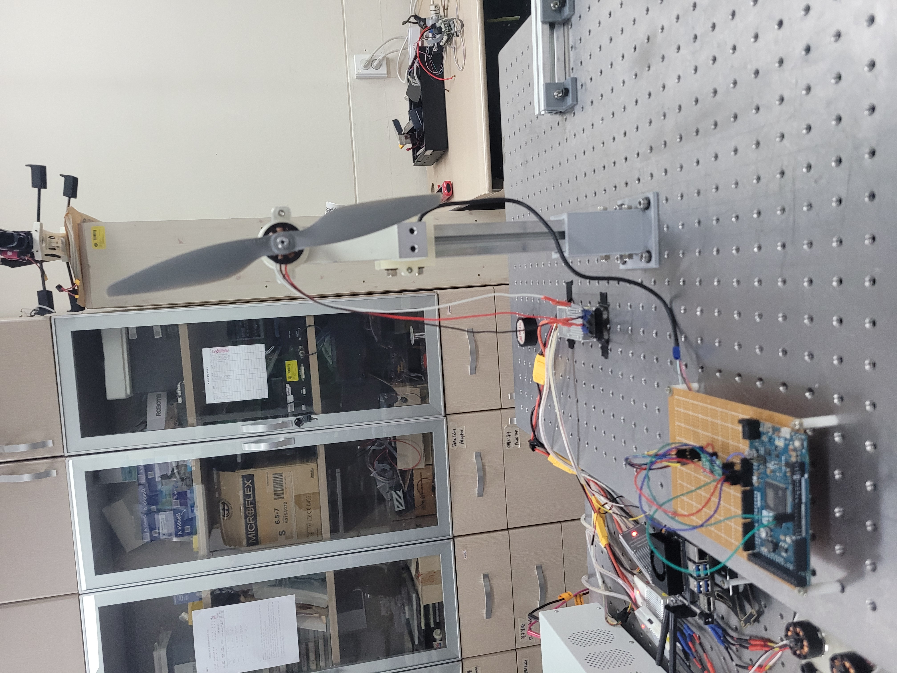
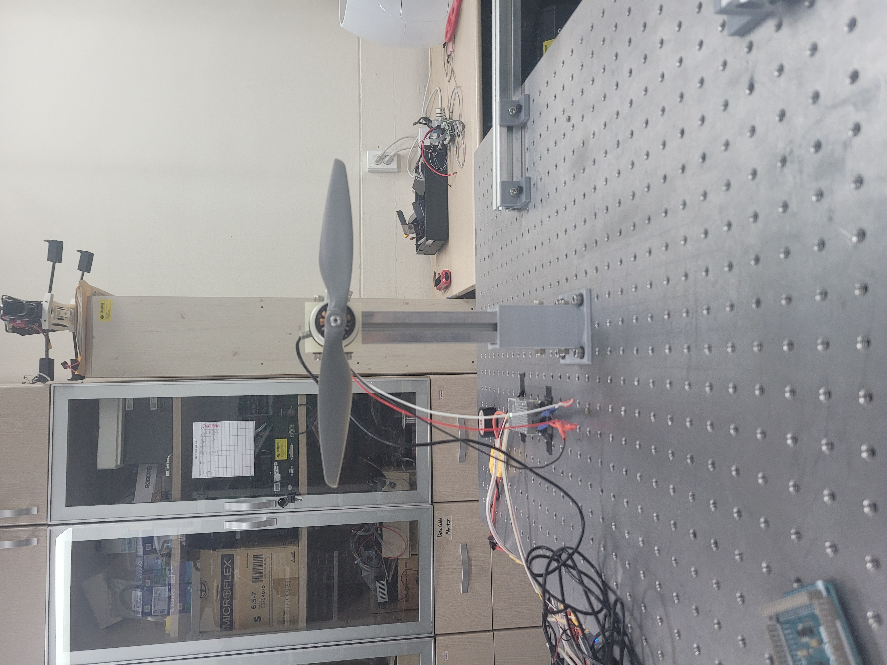

# rotor_thrust_data

Get thrust and moment data with APC 10x4.5 propeller.

Thrust data through YZC-1B with 3 kg capacity.

Moment data through loadcell which can measure static torque.

Its capacity is 3 Nm.

# Thrust mapping

The mapping between cmd raw value and thrust is the following:

$T = p_{T,cmd,1} cmd^2 + p_{T,cmd,2} cmd + p_{T,cmd,3}$

where

$p_{T,cmd,1}$ = 2.548684293700303e-09

$p_{T,cmd,2}$ = -1.949391343612410e-06

$p_{T,cmd,3}$ = 0.001300828508719.

The mapping between rpm and thrust is like the below:

$T = p_{T,rpm,1} cmd^2 + p_{T,rpm,2} cmd + p_{T,rpm,3}$

where

$p_{T,rpm,1}$ = 1.779787156470200e-09

$p_{T,rpm,2}$ = -1.622235767720890e-06

$p_{T,rpm,3}$ = 0.001285904172544.

# Moment mapping

The relationship between cmd raw value and moment is 

$M = p_{M,cmd,1} cmd^2 + p_{M,cmd,2} cmd + p_{M,cmd,3}$

where

$p_{M,cmd,1}$ = 4.002193404061275e-09

$p_{M,cmd,2}$ = -4.057624659431308e-06

$p_{M,cmd,3}$ = -8.175335006894829e-05.

The mapping between rpm and moment is 

$M = p_{M,cmd,1} cmd^2 + p_{M,cmd,2} cmd + p_{M,cmd,3}$

where

$p_{M,cmd,1}$ = 2.794970022546801e-09

$p_{M,cmd,2}$ = -3.381658997734483e-06

$p_{M,cmd,3}$ = -1.029482586449117e-04.
